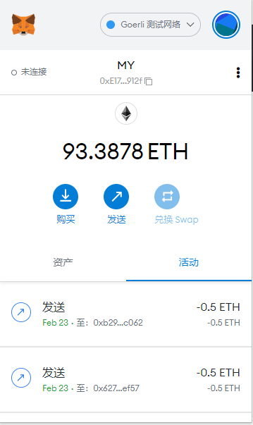
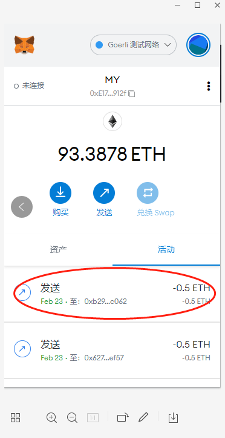
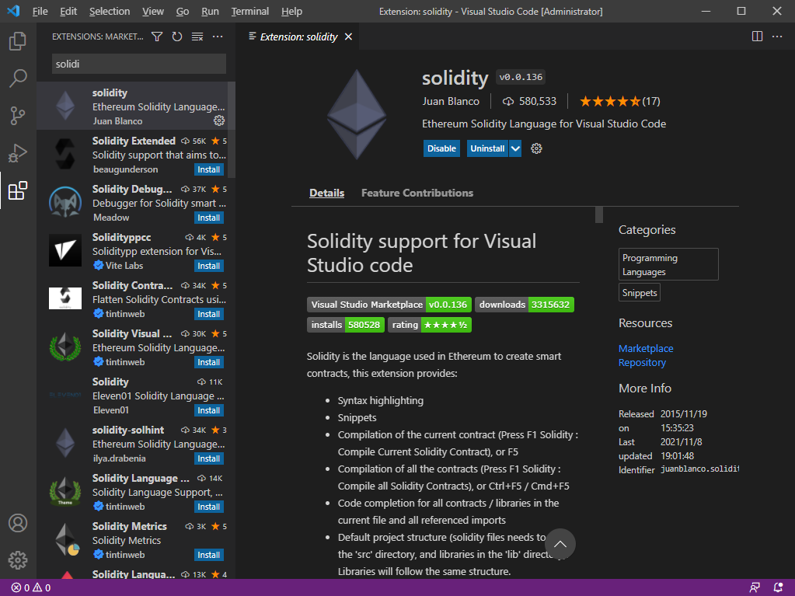
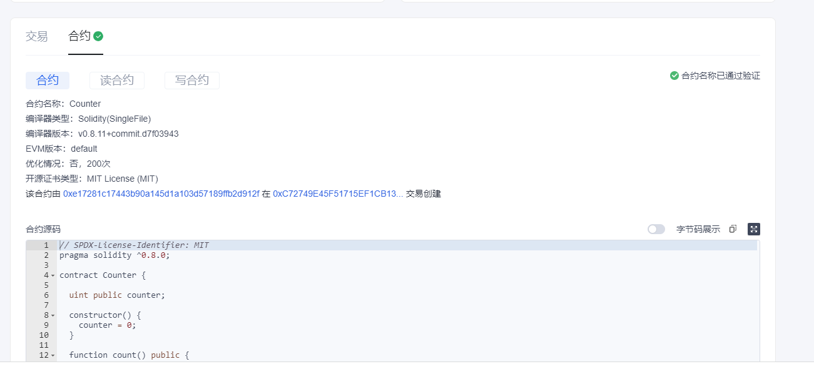
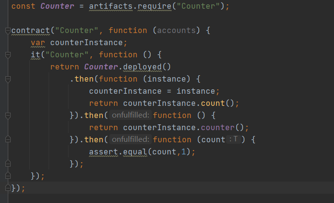
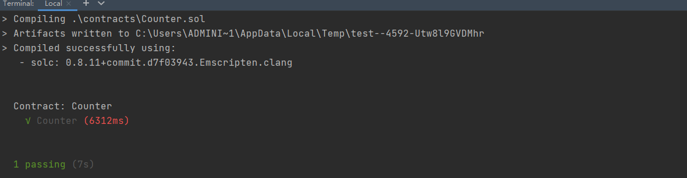

# 区块链技术集训营第一周第一堂课作业
## Metamask安装及账号创建

## 执行一次转账

交易记录:
https://goerli.etherscan.io/tx/0x7a51dbbd5c8c5891a6d638a3bd330e5524685853ad2ab0749248436e4745058a

## 使用Remix创建任意一个合约
交易记录:
https://goerli.etherscan.io/tx/0x7e39e1841cc978077383959f8ad59640ed8f265f3c9455005227aca5c16aad74

## VSCode IDE 开发环境配置

## 使用 Truffle 部署 Counter 合约 到 test 网络
交易记录:

https://www.oklink.com/zh-cn/oec-test/tx/0xC72749E45F51715EF1CB13CF8428AAAD25757B5D93DEB255782B0EAF007E7B5B

合约已验证:

## 编写一个测试用例
测试用例代码:

测试结果:

