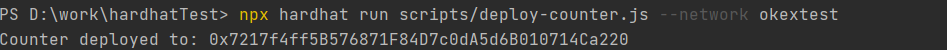
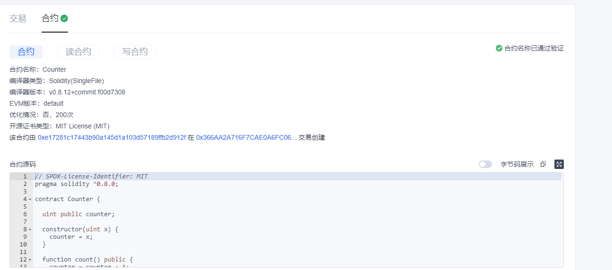
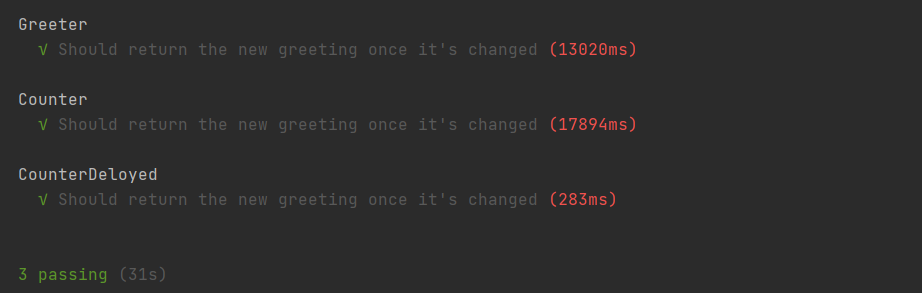
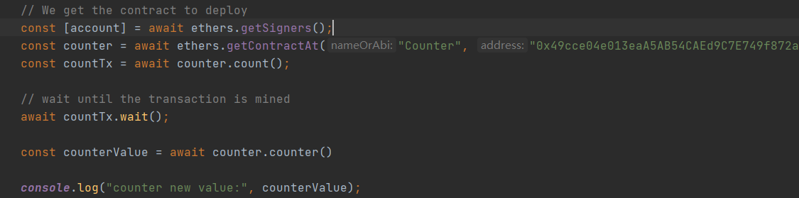

# 区块链技术集训营第一周第二堂课作业
## 使用Hardhat部署修改后的Counter

交易hash:

https://www.oklink.com/zh-cn/oec-test/tx/0x366AA2A716F7CAE0A6FC06EC7980F6C7755D611EBFD80A5846DE2AE859637D69

合约已验证:

## 使用Hardhat测试Counter

## 写一个脚本调用count()
