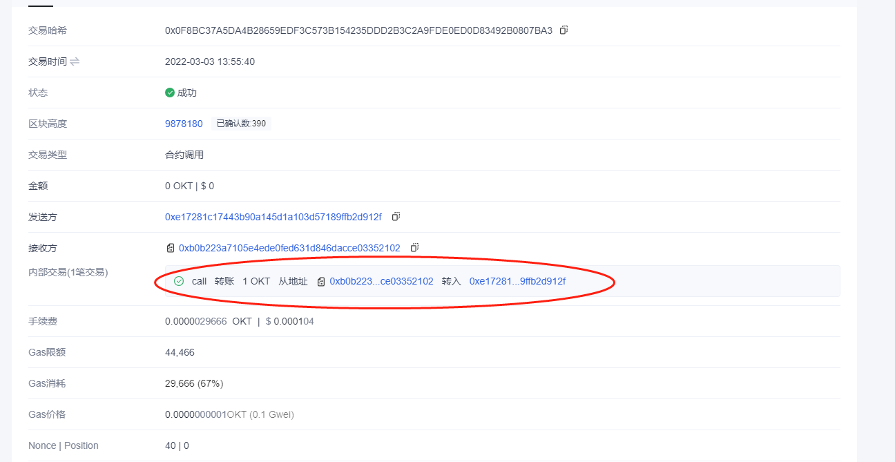

# 区块链技术集训营第二周第一堂课作业
## 编写⼀个Bank合约：

[Bank.sol](./contracts/Bank.sol)

代码已验证:

交易hash:

https://www.oklink.com/zh-cn/oec-test/tx/0xDEC3D28BB50434786AF5861FAD6A25B51D5B7A7D66A3A64F8CA0AA4FA73D585A

## 通过 Metamask 向Bank合约转账ETH

交易hash:

https://www.oklink.com/zh-cn/oec-test/tx/0xFBC53AEA8FCA8B01ACF3259D90769252388B6C5D7464126DBC06C9C38C6DA9EB

## 在Bank合约记录每个地址转账⾦额

## 编写 Bank合约withdraw(), 实现提取出所有的 ETH

交易hash:

https://www.oklink.com/zh-cn/oec-test/tx/0x0F8BC37A5DA4B28659EDF3C573B154235DDD2B3C2A9FDE0ED0D83492B0807BA3
