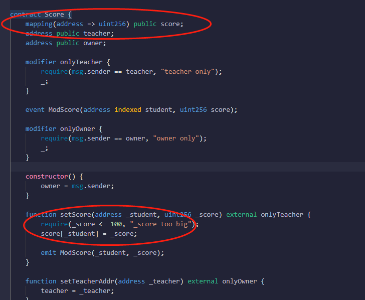
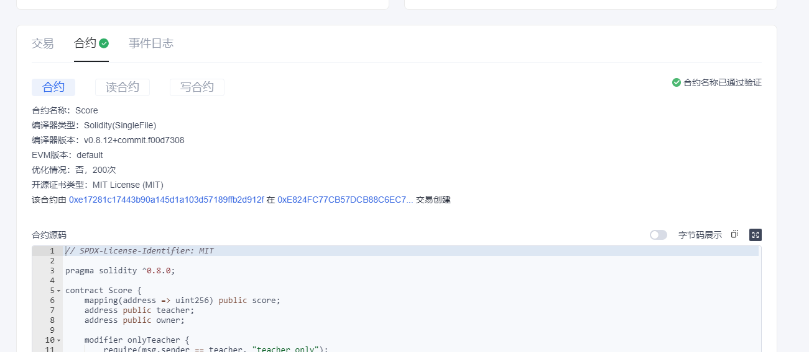
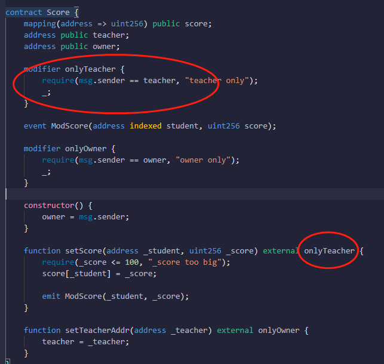
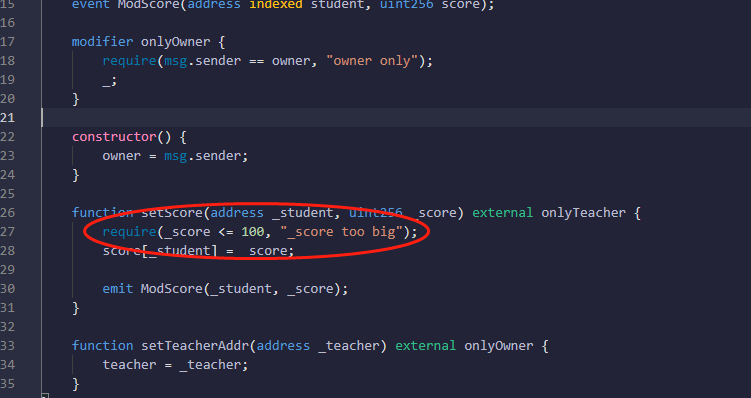
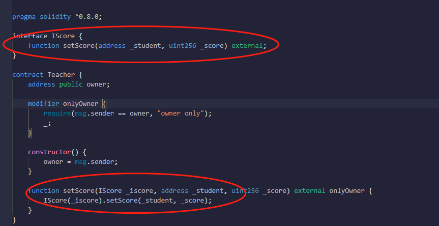
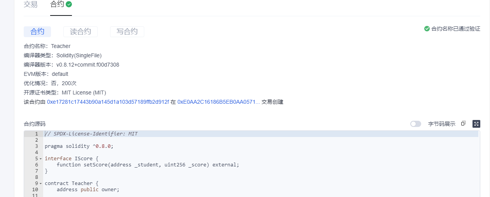

# 区块链技术集训营第二周第二堂课作业
* 编写合约Score，⽤于记录学⽣（地址）分数：
    * 仅有⽼师（⽤modifier权限控制）可以添加和修改学⽣分数
    * 分数不可以⼤于 100；
* 编写合约 Teacher 作为⽼师，通过 IScore 接⼝调⽤修改学⽣分数。
## 编写合约Score，⽤于记录学⽣（地址）分数：

[Score.sol](./contracts/Score.sol)

代码已验证:

交易hash:

https://www.oklink.com/zh-cn/oec-test/tx/0xE824FC77CB57DCB88C6EC782FD20B5D72A88E7CCBA717406FF0EEB4C4A17D266

## 仅有⽼师（⽤modifier权限控制）可以添加和修改学⽣分数

## 分数不可以⼤于 100

## 编写合约 Teacher 作为⽼师，通过 IScore 接⼝调⽤修改学⽣分数。

[Teacher.sol](./contracts/Teacher.sol)

代码已验证:

交易hash:

https://www.oklink.com/zh-cn/oec-test/tx/0xE0AA2C16186B5EB0AA05715DED28D2A68619B68A72E5B9611585789D88633DBF