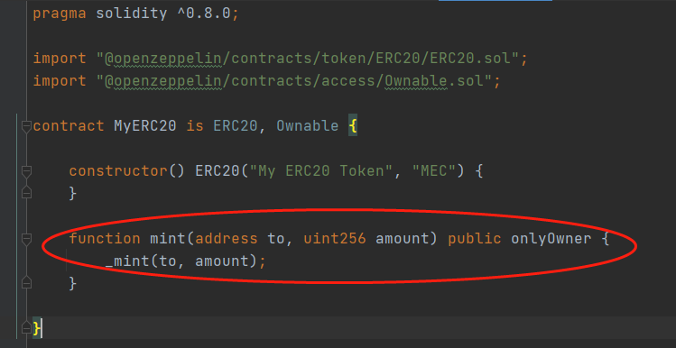
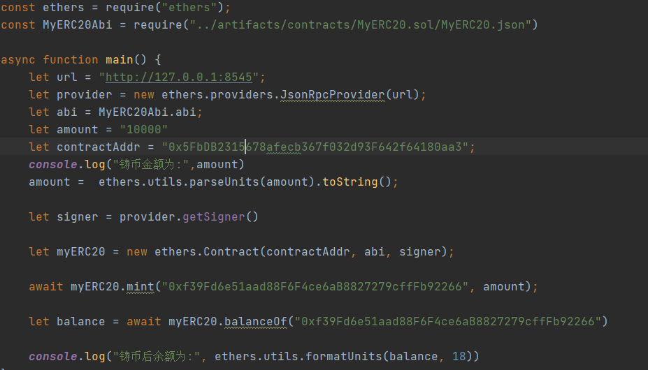
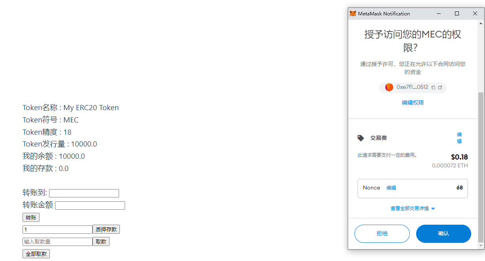
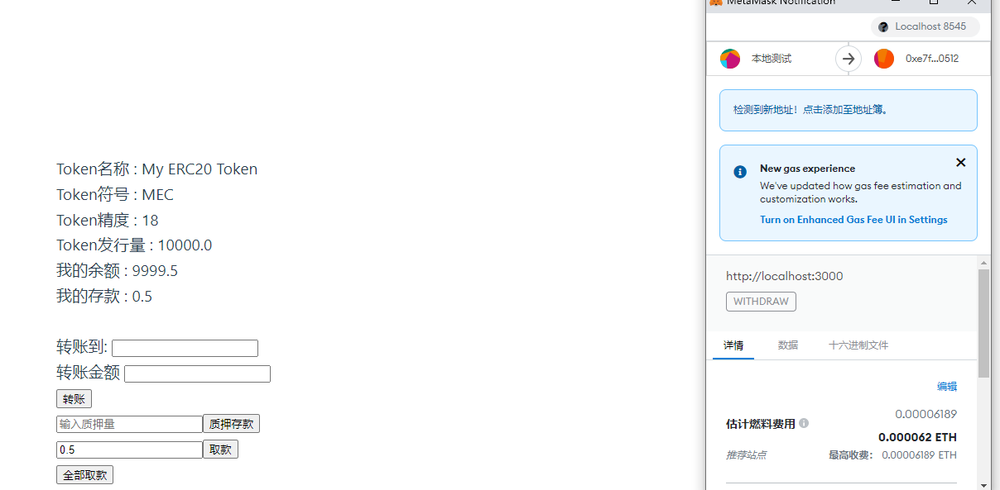
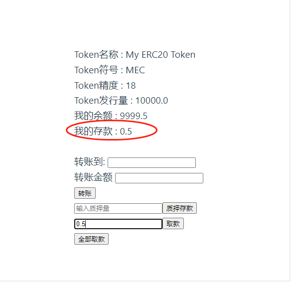

# 区块链技术集训营第三周第一堂课作业

## 发⾏⼀个 ERC20 Token
[MyERC20.sol](./w3_code/contracts/MyERC20.sol)
## 可动态增发（起始发⾏量是 0）

## 通过 ethers.js. 调⽤合约进⾏转账
[test-ethers.js](./w3_code/scripts/test-ethers.js)

## 编写⼀个Vault 合约：
[Vault.sol](./w3_code/contracts/Vault.sol)
## 编写deposite ⽅法，实现 ERC20 存⼊ Vault，并记录每个⽤户存款⾦额 ， ⽤从前端调⽤（Approve，transferFrom）

## 编写 withdraw ⽅法，提取⽤户⾃⼰的存款 （前端调⽤）

## 前端显示⽤户存款⾦额
