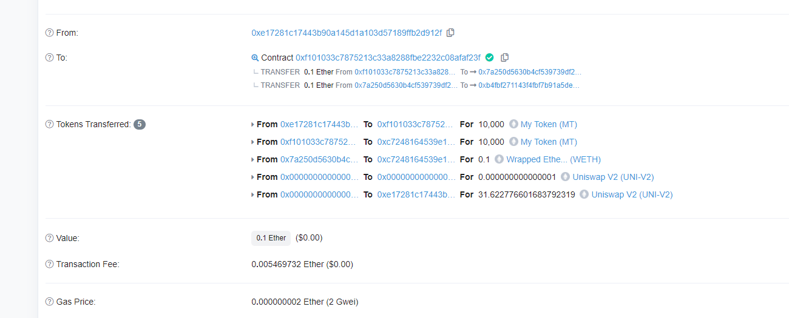
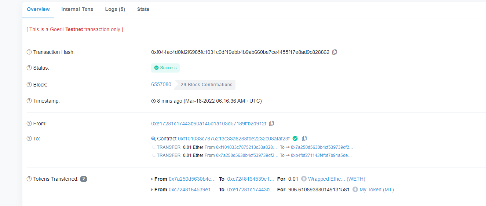

# 区块链技术集训营第四周第一堂课作业

## 部署自己的 ERC20 合约 MyToken
[MyToken.sol](./w4_1_code/contracts/MyToken.sol)

部署交易hash：

https://goerli.etherscan.io/tx/0x2eeebe737d0137316d9c72129804a3e46e16a2a77b6fd5bd98ad8059fa6431f9

## 编写合约 MyTokenMarket 实现：
[MyTokenMarket.sol](./w4_1_code/contracts/MyTokenMarket.sol)

部署交易hash：
https://goerli.etherscan.io/tx/0xaa52426d9489bfaeb4f79768e5ae3ecc73f0d278e84b925565faec23fa0b439f

### AddLiquidity():函数内部调用 UniswapV2Router 添加 MyToken 与 ETH 的流动性

交易hash：

https://goerli.etherscan.io/tx/0x6a01778b8894d9c8f38eef21e237a7276c2033674fb28b3d340d289285ae9c8a

### buyToken()：用户可调用该函数实现购买 MyToken

交易hash：

https://goerli.etherscan.io/tx/0xf044ac4d0fd2f6985fc1031c0df19ebb4b9ab660be7ce4455f17e8ad9c828862
