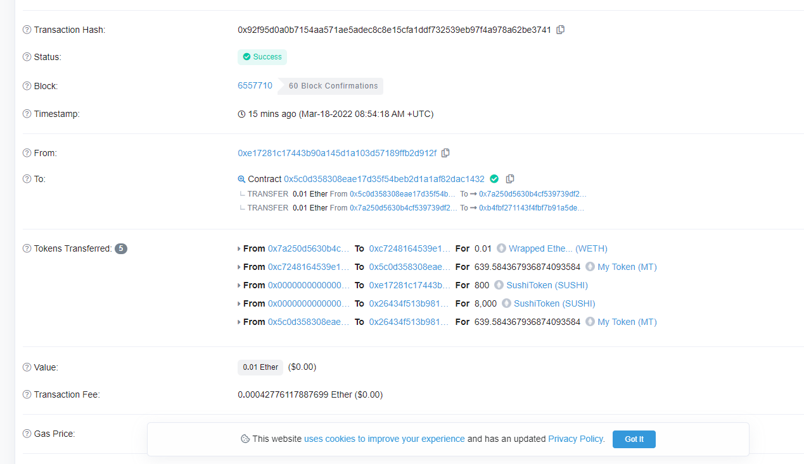
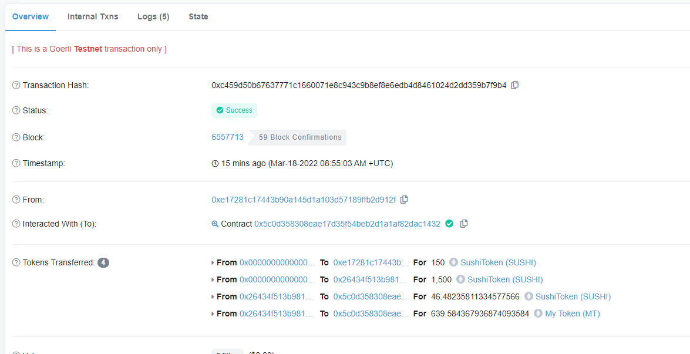

# 区块链技术集训营第四周第二堂课作业

## 在上一次作业的基础上：
[MyTokenMarket.sol](./w4_2code/contracts/MyTokenMarket.sol)

部署交易hash：

https://goerli.etherscan.io/tx/0x0d8b98c66c533a36d8c785f17ac6af97a6a9e30cfbb681b4f6e7f75ae5e8a9c6

### 完成代币兑换后，直接质押

交易hash：
https://goerli.etherscan.io/tx/0x92f95d0a0b7154aa571ae5adec8c8e15cfa1ddf732539eb97f4a978a62be3741

### withdraw():从 MasterChef 提取 Token 方法

交易hash：

https://goerli.etherscan.io/tx/0xc459d50b67637771c1660071e8c943c9b8ef8e6edb4d8461024d2dd359b7f9b4