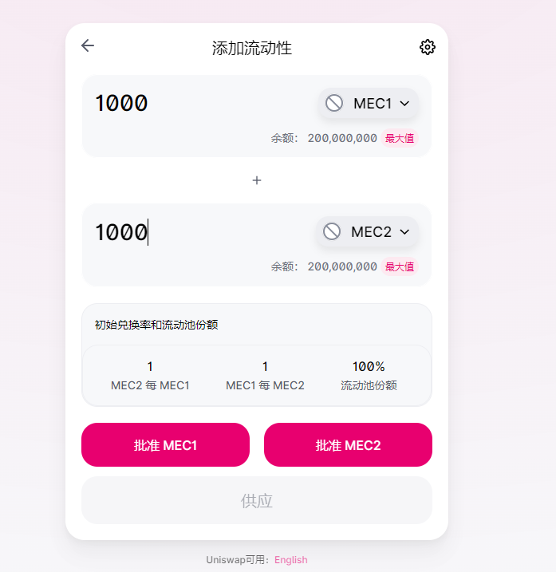
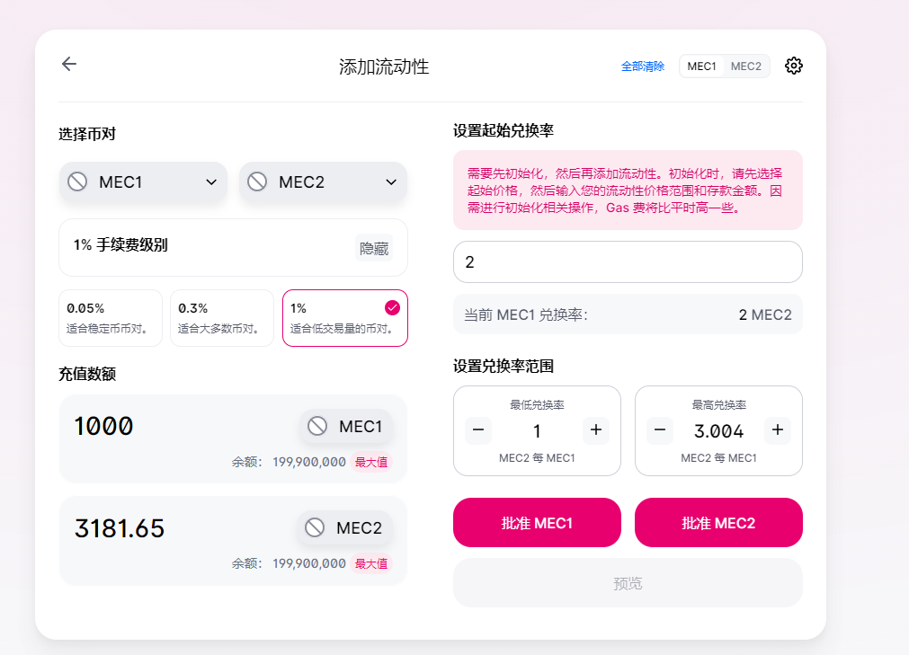

# 区块链技术集训营第五周第一堂课作业

## 以太坊测试网上部署两个自己的ERC20合约MyToken，分别在Uniswap V2、V3(网页上)添加流动性

V2添加流动性交易hash：

https://goerli.etherscan.io/tx/0x4fd847bc31e61697d38749cfc832b4dd4579c9493f8433806bd386fbc984e1ca

V3添加流动性交易hash：
https://goerli.etherscan.io/tx/0x465acdea9d5b9e9cbd9f7d555f78bcad377ce79d54971c69a48d24ee057a6954

## 编写合约执行闪电贷（参考V2的ExampleFlashSwap）
### uniswapV2Call中，用收到的 TokenA 在 Uniswap V3 的 SwapRouter 兑换为 TokenB 还回到 uniswapV2 Pair 中。
[ExampleFlashSwap.sol](./contracts/ExampleFlashSwap.sol)
交易hash：
https://goerli.etherscan.io/tx/0xf770464a32e886ab9083c25e23edc26e4906ac78d1fd5f85b370650be01c9c20